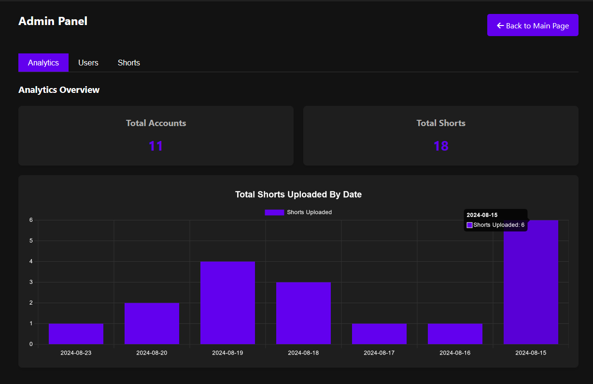

<h1>Vidzy</h1>
A free and open source alternative to TikTok

<a href="https://vidzy.codeberg.page/">Website</a>
&nbsp;•&nbsp;
<a href="https://matrix.to/#/#vidzysocial:fedora.im">Matrix</a>

 

 

## Install

    git clone https://github.com/vidzy-social/vidzy
    cd vidzy
    pip install -r requirements.txt
    cp .env.sample .env
    # Use your preferred editor to configure .env (ex. 'nano .env')
    python -m waitress --port=8080 --call app:create_app

## Screenshots

### Homepage

### Admin Panel

## Features

We have very ALPHA federation through [ActivityPub](https://www.w3.org/TR/activitypub/).

## Contributing

Thank you for considering contributing to Vidzy! To contribute, fork the repo and add your contribution. Then, send a pull request and if it is helpful we will gladly accept it.

## Security Vulnerabilities

If you discover a security vulnerability within Vidzy, please send an e-mail to me via [vidzy_social@proton.me](mailto:vidzy_social@proton.me). All security vulnerabilities will be promptly addressed.

## License

Vidzy is open-source software licensed under the GNU Affero General Public License v3.0

## Contributors

<!-- ALL-CONTRIBUTORS-LIST:START - Do not remove or modify this section -->
<!-- prettier-ignore-start -->
<!-- markdownlint-disable -->
<table>
  <tbody>
    <tr>
      <td align="center" valign="top" width="14.28%"><a href="https://github.com/ProgramminCat"> <b>ProgramminCat</b></a> <a href="#code-ProgramminCat" title="Code">💻</a> <a href="#design-ProgramminCat" title="Design">🎨</a> <a href="#ideas-ProgramminCat" title="Ideas, Planning, & Feedback">🤔</a> <a href="#question-ProgramminCat" title="Answering Questions">💬</a> <a href="#maintenance-ProgramminCat" title="Maintenance">🚧</a> <a href="#review-ProgramminCat" title="Reviewed Pull Requests">👀</a> <a href="#security-ProgramminCat" title="Security">🛡️</a></td>
      <td align="center" valign="top" width="14.28%"><a href="https://github.com/kodxana"> <b>Madiator2011</b></a> <a href="#design-kodxana" title="Design">🎨</a> <a href="#code-kodxana" title="Code">💻</a></td>
      <td align="center" valign="top" width="14.28%"><a href="https://github.com/nycterent"> <b>Marty</b></a> <a href="#code-nycterent" title="Code">💻</a></td>
      <td align="center" valign="top" width="14.28%"><a href="https://chuso.net"> <b>Chuso Pérez</b></a> <a href="#security-chusopr" title="Security">🛡️</a></td>
    </tr>
  </tbody>
</table>

<!-- markdownlint-restore -->
<!-- prettier-ignore-end -->

<!-- ALL-CONTRIBUTORS-LIST:END -->
